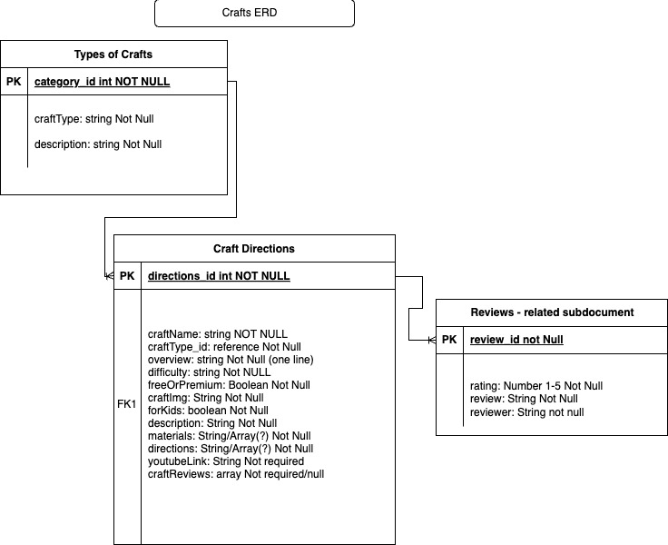

# Craftopia: Your Go-To Resource for Arts & Crafts

## About
Do you ever want to make some art and crafts but don't know where to start? Tired of looking for new crafts only to be bogged down by blog post after blog post? Then welcome to **Craftopia**, the ultimate destination for arts and crafts enthusiasts! Whether you're a beginner or a seasoned crafter, you'll find a wealth of inspiration and practical guidance to create your next masterpiece. Craftopia simplifies the crafting journey by offering a curated database of craft ideas, complete with step-by-step instructions. Say goodbye to endless blog posts and hello to your next DIY project!

## ERD

I want my crafts and types to be seperate collections. Types will be the parent of Crafts. My reviews will be embedded documents within the Craft data and not a seperate collection. Materials and Directions will also be embedded documents within the craft data. 

## Display

I would like my craft types and some other filters to appear as rotating buttons on a carousel. When clicking the button the craft type's collection of crafts should appear on the page. You can then click a craft of your choice and the details will appear. In this details section there will be a review section at the bottom with a button to add reviews. A new div or page should appear to add review. Review should appear after user posts.

## Goals
- **Update Project Utilizing MERN Stack:** Update a previous project using basic HTML, CSS, and JavaScript into a MERN stack (MongoDB, Express, React, Node) application.
- **Data Retrieval:** Successfully retrieve all requested data from MongoDB using efficient query techniques.
- **User Interaction:** Implement functionality for users to POST new reviews associated with specific crafts.
- **Responsive Design:** Create a well-styled, responsive web page that enhances user experience across devices.
- **Search Functionality:** Develop a search feature that displays crafts based on user-defined search terms.
- **Dashboard Functionality:** Develop a dashboard for a user to see their favorite crafts when logged in.
- **Mobile Friendly:** Create a mobile friendly design for users on the go.

